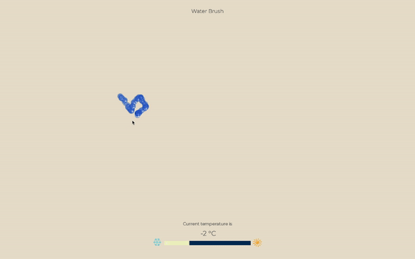

# Water Brush 💧
### Interactive Brush using [Processing](https://processing.org/)
</img>
> `Water Brush` is a project which describes what it would be like to have water as brush element.
> Among the various characteristics of water, this project reflects the varies in water shape depending on temperature. So you can experience various brush effects by changing temperature slider below the screen.

 

## Details
### Between 20℃ and 40℃
</img>
</img>
</img>

 

### Between 1℃ and 19℃
</img>

 

### Below 0℃
</img>
